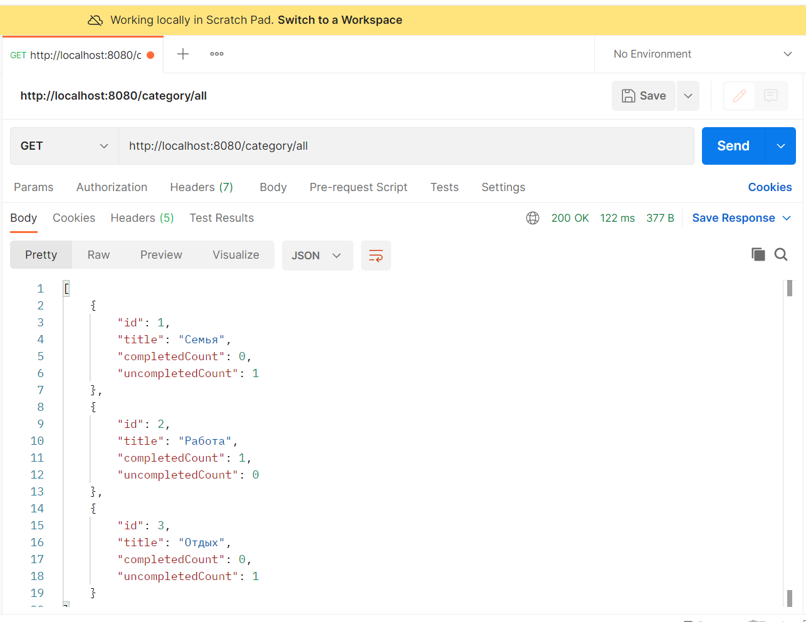

<a href="/README.md">вернуться к оглавлению</a>

Выборочное тестирование проекта с помощью программы Postman  
Запускаем проект, открываем Postman, и начинаем делать запросы. 
(скрины результатов в этой папке) 

1. Запрос POST localhost:8080/priority/save  

priority_save.png

2. Запрос GET localhost:8080/category/all

category_all.png

3. Поиск по задачам
Запрос POST localhost:8080/task/search

task_search.png

 

